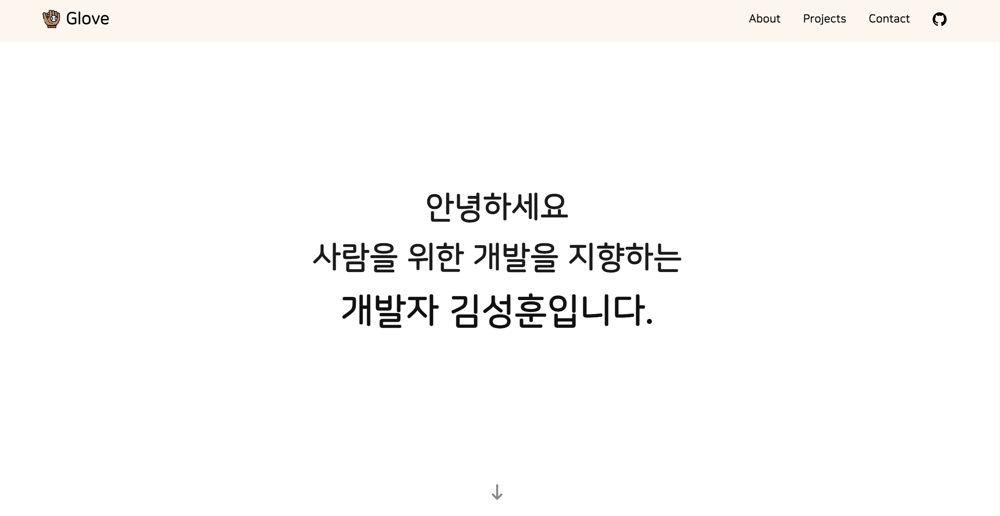
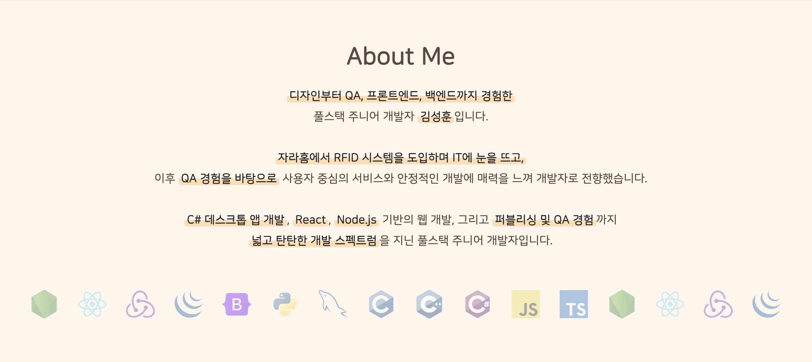
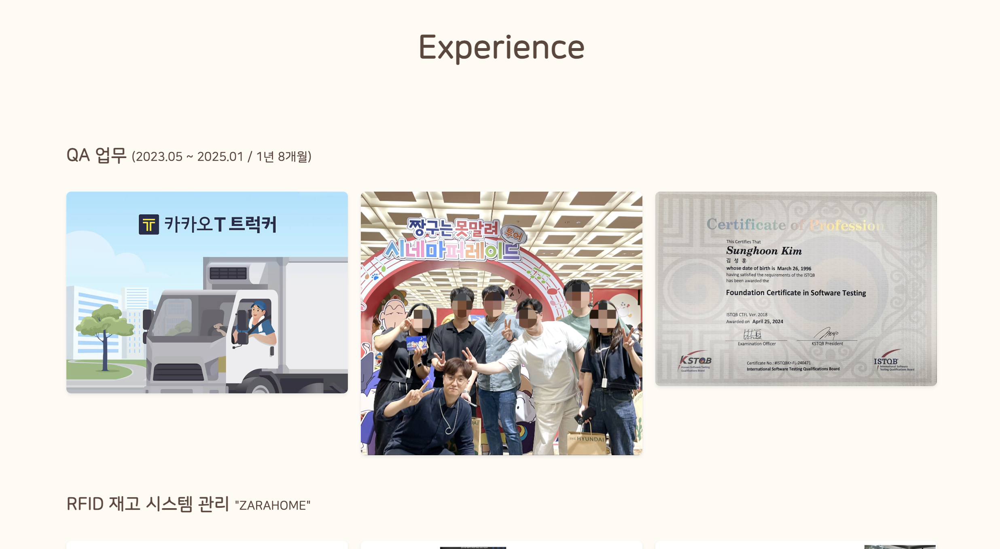
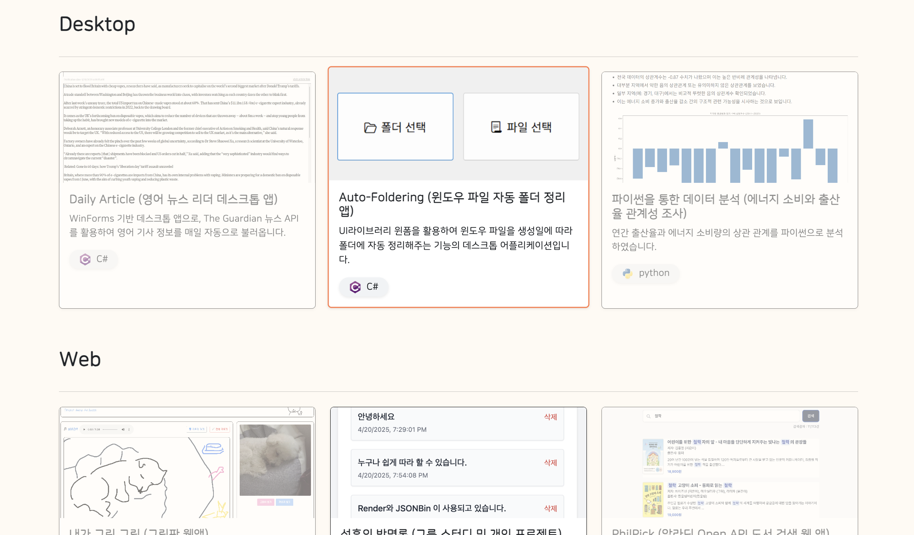

# 🎨 Glove Project
> 백엔드, 프론트엔드, QA, 디자인까지 경험 후 제작한 풀스택 개발자 포트폴리오

 | 
--|--|
 | 

<br>

Links  
[🌐 사이트 바로가기](https://tony96kimsh.github.io/glove)  
[📘 작업 로그(노션)](https://www.notion.so/Glove-portfolio-Page-201f398452c3802f98fef36ef10fd6bc?source=copy_link)  


## 프로젝트 개요

### 💡 제작 배경  
- 다양한 프로젝트를 QA하면서 완성도 있는 마무리의 중요성을 느꼈고,  
  "어떤 공이든 안정적으로 글로브에 안착하듯이" 완결된 개발 결과물을 만들고 싶어 시작한 프로젝트입니다.  
- `Glove`라는 이름은 그런 바람에서 비롯되었고, 개발자로서의 정체성과 태도를 표현합니다.

### 🛠 기술 스택  
**Frontend**: React, TypeScript, TailwindCSS, React-Bootstrap  
**Backend**: Node.js (계획 중)  
**Build/Deploy**: Vite, GitHub Pages  
**Tools**: Git, VSCode, Notion

### ✨ 주요 기능  
1. 포트폴리오 프로젝트 모달 보기 (React + Markdown 렌더링)  
2. 기술 스택 마퀴(흘러가는 배너)  
3. 컴포넌트 기반 모듈화된 구조  
4. 반응형 UI  


## 프로젝트 구조

### 🖼 레이아웃 구성  
- `Header`: 네비게이션 바  
- `Intro`: 자기소개 문구와 이모지  
- `About`: 기술스택 마퀴  
- `Project`: 프로젝트 카드 + 모달  
- `Experience`: 경력 소개  
- `Contact`: 이메일 링크  

### 📁 폴더 구조  
```
src/
├── assets/               # 이미지 및 정적 리소스
├── component/            # 주요 컴포넌트 모음
│   ├── About.tsx
│   ├── Contact.tsx
│   ├── Experience.tsx
│   ├── Header.tsx
│   ├── Intro.tsx
│   ├── Project.tsx
├── data/
│   └── datas.ts          # 프로젝트/기술스택 데이터
├── style/                # CSS 파일 (Tailwind/Bootstrap 혼용)
│   └── Project.css
├── App.tsx
└── main.tsx
```

### 📜 코드 구조  
- 데이터와 UI를 분리하여 관리  
- 마크다운 파일을 동적으로 불러와 모달에 렌더링  
- 타입 안정성을 위한 TypeScript 활용  
- 반복되는 UI는 map + props 로 효율적으로 구성