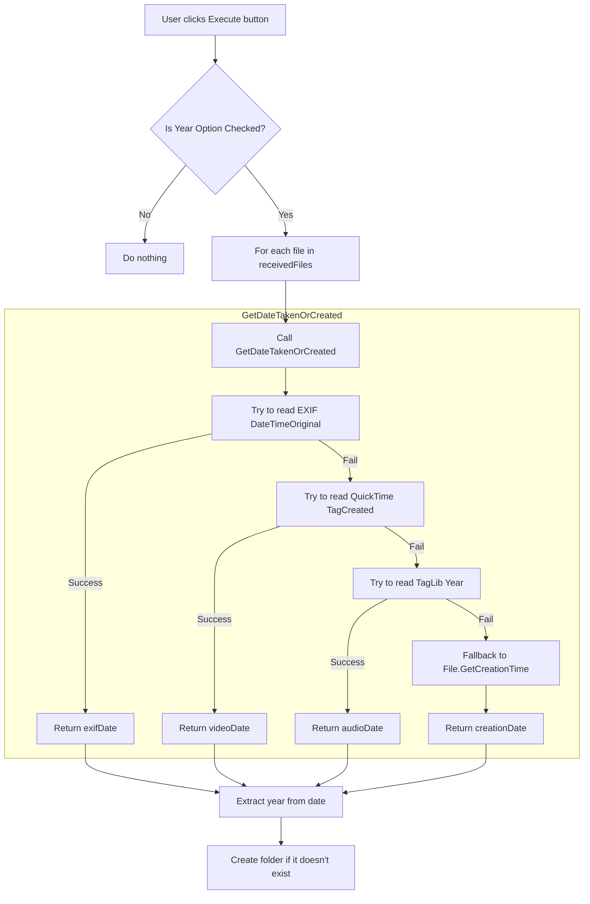

# 🗂️ Auto Foldering (날짜별 윈도우 파일 정리 앱)
> .NET 프레임워크의 UI 라이브러리 WinForms을 활용한 C# 프로젝트

  | | 
--|--|--

- **[⬇ 실행 파일 다운로드 링크](https://github.com/tony96kimsh/Auto-Foldering/raw/refs/heads/main/bin/Release.zip)** (압축 해제 후 `Auto-Foldering.exe` 파일 실행)

- **[❓ 사용 방법 안내](https://github.com/tony96kimsh/Auto-Foldering/blob/main/사용방법.md)**

## 📝 프로젝트 개요

### 💡 제작 배경
- 윈도우 환경에서 많은 파일을 일일이 폴더를 만들어 정리하는 건 힘든 일입니다. **대부분의 경우 시간 기준으로 폴더를 나누는 것만으로도 충분**하나, 일일이 손으로 하기에는 많은 시간이 듭니다. 그래서 여러 파일을 **생성 날짜 기준으로 자동 분류 및 폴더링**해주는 데스크탑 어플리케이션을 제작하게 되었습니다.

### 🛠️ 기술 스택
- C# (.NET Framework)
- WinForms (윈도우 UI 프레임워크)
- System.IO (파일/디렉토리 처리)
- NuGet Package(`MetadataExtractor`, `TagLibSharp`)

### ✨ 주요 기능


1. OpenFileDialog를 통해 정리 대상 파일 선택
2. FolderBrowserDialog를 통해 저장 경로 설정
3. 라디오버튼을 통한 정리 기준 선택 UI
4. Placeholder 및 숫자 제한을 포함한 사용자 입력 기능
5. 원본 경로와 저장 경로 표시 및 변경 기능
6. **파일 생성일 기준으로 연/월/주 폴더 자동 생성 및 이동**
    
    - 사진, 영상, 음악 파일의 경우 라이브러리를 활용한 생성일로 구분 
    - 기타 형식의 경우 추가일(윈도우 생성일)로 폴더 구분

7. 정리 실행 후 결과 확인 메시지 제공

## 🧱 프로젝트 구조

### 🖼️ 레이아웃 구성
- Form1: 파일 선택 및 저장 위치 지정, Form2로 이동
- Form2: 정리 기준 선택, 실행 및 경로 표시

### 📂 폴더 구조
```
Auto_Foldering/
├── Form1.cs         # 초기 폴더/파일 선택 폼
├── Form2.cs         # 정리 기준 및 실행 폼
├── Program.cs       # Main 함수
├── *.Designer.cs    # 디자이너 자동 생성 파일
└── Resources/
    └── image.png
```

### 🧩 코드 구조

#### Form1
- `receivedFiles` 배열에 선택한 파일 저장
- `selectedDirectory` 를 통해 초기 경로 전달
#### Form2

- 라디오버튼 이벤트로 정리 기준 선택
- `File.GetDateTakenOrCreated()`으로 파일 날짜 판별
    
  - 사진 파일의 경우 `MetadataExtractor` 라이브러리로 생성일 판별
  - 음악 파일의 경우 `TagLib` 라이브러리로 생성일 판별
  - 포함되지 않는 파일인 경우 시스템 표준 함수 `File.GetCreationTime`로 생성일 판별

- `Directory.CreateDirectory()`로 폴더 생성
- `File.Copy()`로 정리 경로에 복사

<br>

### 🧭 연간 날짜 구분으로 실행 시, 판별 로직 다이어그램



<br>

## 🚧 추후 작업 및 이슈

### 📌 TODO
- 중복 파일 처리 로직 개선
- 정리 결과 요약 화면 또는 로그 기록 기능
- 파일 복사, 이동 유무 토클 기능 추가 필요

### 🐞 Issues
- 파일 경로가 긴 경우 UI 레이블 표시 깨짐
- 복수 파일 처리 시 성능 개선 필요
- 비정상 파일명 예외처리 추가 예정

## 📚 Reference

### 📦 NuGet Package

- [MetadataExtractor](https://github.com/drewnoakes/metadata-extractor-dotnet)  
  이미지 및 영상 파일의 메타데이터(EXIF, QuickTime 등)를 읽기 위한 라이브러리.  
  사진의 촬영일자, 영상의 생성일자 등을 추출할 수 있음.

- [TagLibSharp](https://github.com/mono/taglib-sharp)  
  오디오 및 일부 영상 파일(MP3, FLAC, MP4 등)의 메타데이터(ID3, 제목, 앨범 등)를 읽고 쓰는 라이브러리.  
  음악 파일의 발매 연도, 녹음 날짜 등을 추출하는 데 사용됨.

- [XmpCore](https://github.com/drewnoakes/metadata-extractor-dotnet/tree/master/XmpCore)  
  Adobe의 XMP 메타데이터를 처리하기 위한 라이브러리로, `MetadataExtractor`의 내부 동작에 필요.  
  JPEG, PDF 등에서 사용되는 XMP 메타데이터 처리를 지원함.

### 🖼️ Image
- [앱 아이콘 EmojiDex 이미지 사용](https://www.emojiall.com/ko/image/🗄)