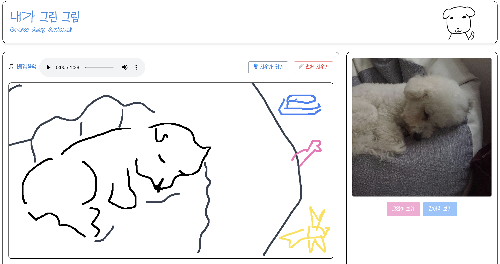
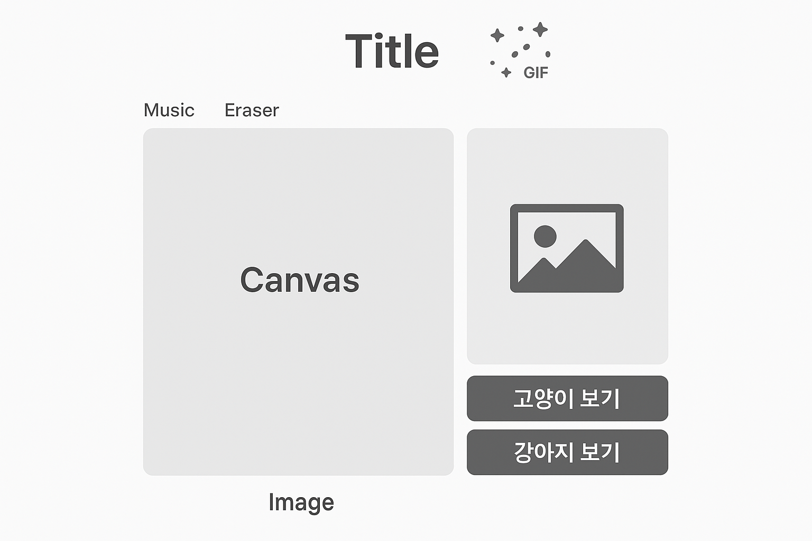
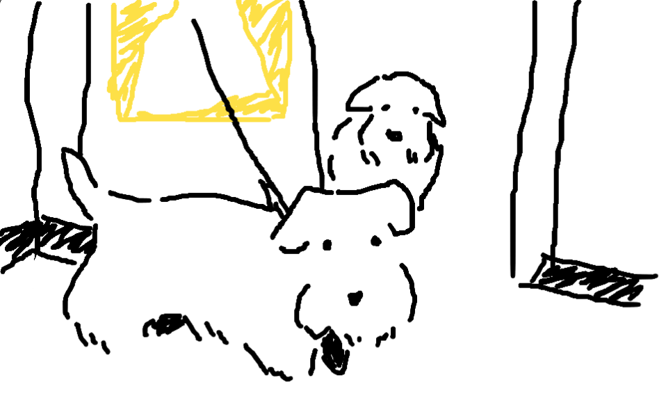
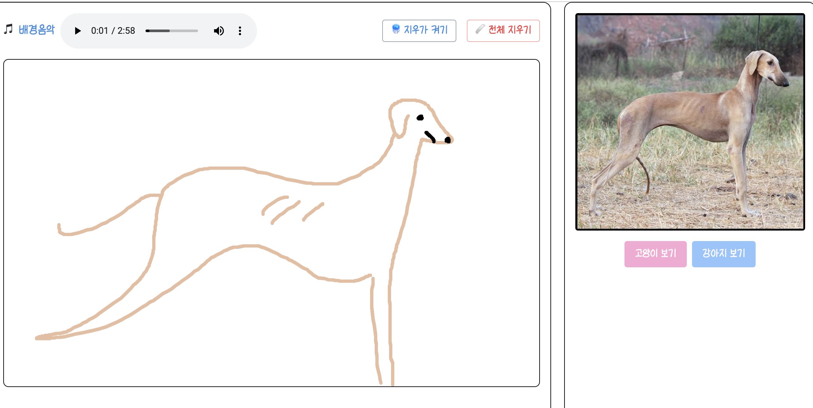
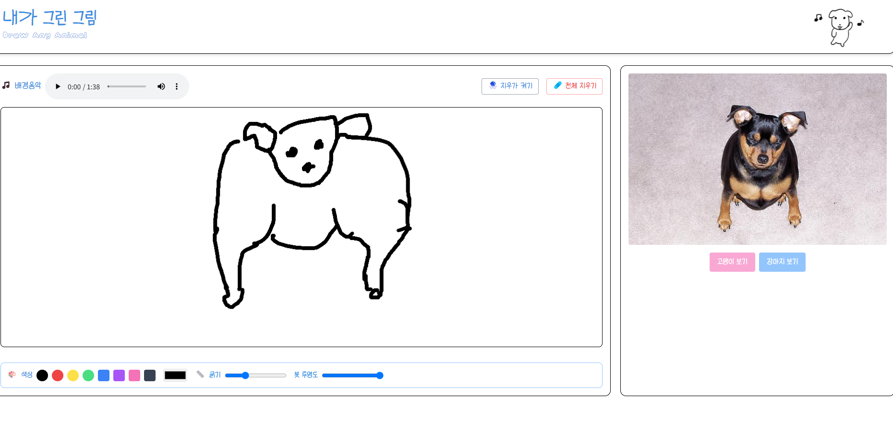
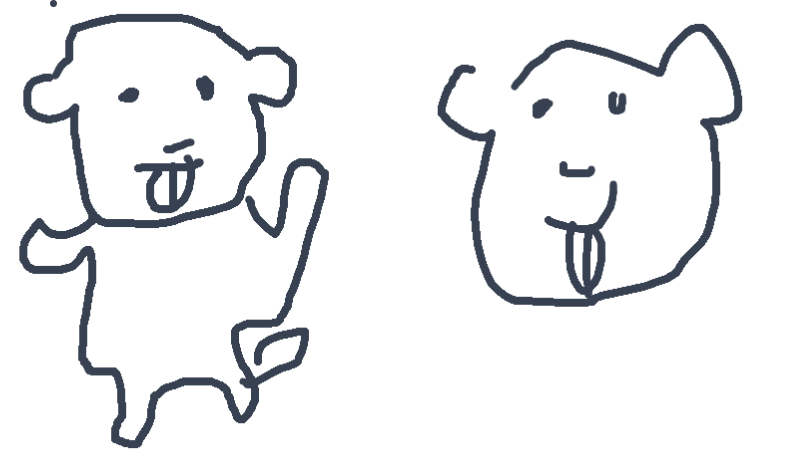
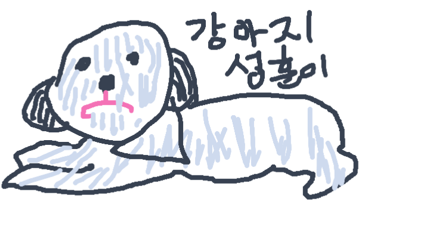
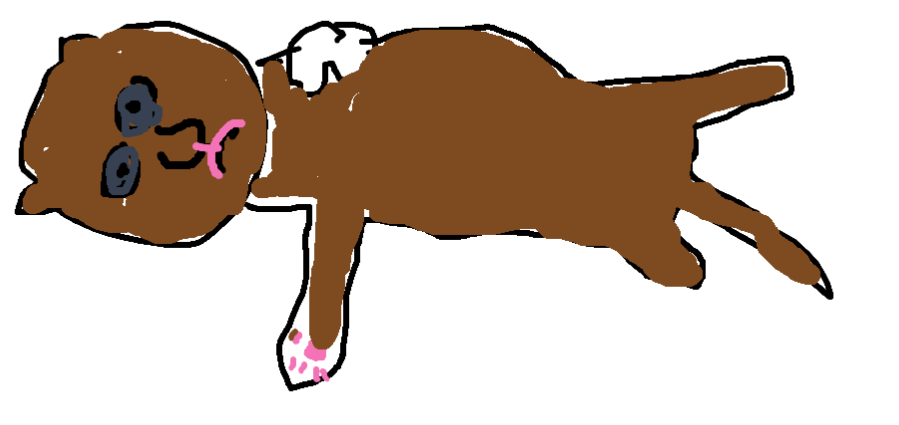
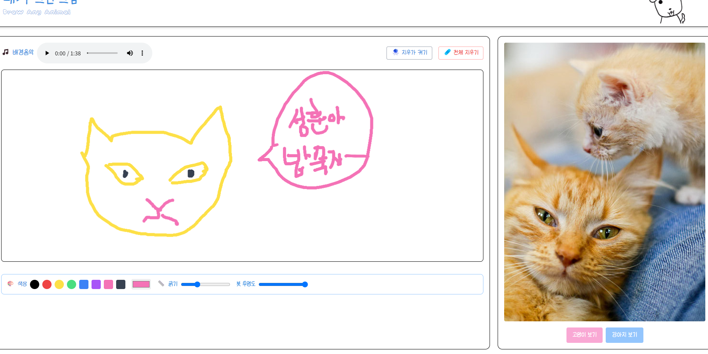

# 🎨 DrawAnyAnimal - 내가 그린 그림
> HTML5 API(canvas, audio) 기능 제어하기

 | 
--|--|

링크

- [🔗 사이트 바로가기](https://tony96kimsh.github.io/DrawAnyAnimal)  

- 📘 [작업 로그(노션)](https://stump-smartphone-024.notion.site/HTML-5-1d0f398452c380a4b80dfd5fe4baa91a?pvs=4)

---

# 📖 프로젝트 소개
- 설치 없이 누구나 쉽게 사용 가능한 웹 기반 그림판 어플리케이션
- 귀엽고 깔끔한 디자인과 밝은 배경음악으로 친근한 분위기 제공
- 강아지와 고양이 사진 API를 통해 특색있는 그림판 앱 제공

### 🛠 기술 스택
- JavaScript (Canvas API, Audio API, Fetch API)
- Tailwind CSS

## 주요 기능
1. canvas API를 통한 그림판 기능
   - 붓 색상, 굵기, 투명도, 지우개 기능 제공
2. 고양이, 강아지 API를 통해 다양한 참고 동물 사진 제공
3. Audio API를 통한 배경음악 기능 제공

## 🧱 구조

### 🖼 레이아웃 구조


### 폴더 구조

```tree
── README.md
├── 📁bg // 샘플 배경 음악
├── 📁img // 샘플이미지
├── index.html
└── src
    ├── audio.js // 배경음악 제어
    ├── canvas.js // 그림판 제어
    └── photo.js // 사진 API 제어
```

### 📜 코드 구조

#### audio.js

사용된 내장 함수와 이벤트

- `DOMContentLoaded`: HTML 문서 로드 후 오디오 요소 삽입
- `ended`: 재생 끝난 후 다음 곡 자동 전환
- `document.createElement('audio')`: 오디오 요소 생성
- `.src`: 음악 파일 경로 설정
- `.controls`: 오디오 UI 표시
- `.loop`: 자동 반복 재생 여부
- `.play()`: 음악 재생
- `addEventListener('ended', callback)`: 다음 곡 재생 로직
- `shuffle(array)`: Fisher-Yates 셔플 알고리즘으로 곡 리스트 섞기

```js
function shuffle(array) {
  let currentIndex = array.length, randomIndex;
  while (currentIndex !== 0) {
    randomIndex = Math.floor(Math.random() * currentIndex);
    currentIndex--;
    [array[currentIndex], array[randomIndex]] = [
      array[randomIndex], array[currentIndex]
    ];
  }
}
```

#### canvas.js

- `mousedown`, `mousemove`, `mouseup`, `mouseleave`: 드로잉 제어
- `canvas.getContext("2d")`, `.beginPath()`, `.stroke()`: 선 그리기
- `clearRect`: 캔버스 초기화
- `lineWidth`, `lineCap`, `lineJoin`: 선 스타일
- `globalAlpha`: 투명도
- `hexToRgba(hex, alpha)`: 색상 변환
- 커서 커스터마이징: 스타일 변경

#### photo.js

```js
async function fetchDogImage() {
  try {
    showLoader();
    const res = await fetch('https://dog.ceo/api/breeds/image/random');
    const data = await res.json();
    animalImage.src = data.message;
  } catch (err) {
    console.error("강아지 이미지를 불러오는 데 실패했어요 🐶", err);
  } finally {
    hideLoader();
  }
}
```

- fetch API vs jQuery AJAX 비교

```js
// fetch
fetch('https://api.example.com/data')
  .then(res => res.json())
  .then(data => console.log(data));

// jQuery AJAX
$.ajax({
  url: 'https://api.example.com/data',
  success: function(data) {
    console.log(data);
  }
});
```

- async/await 설명
  - async: Promise 반환
  - await: 처리될 때까지 기다림
  - 비동기 흐름을 동기처럼 작성 가능

- Open API 설명
  - The Cat API: `https://api.thecatapi.com/v1/images/search`, `data[0].url`
  - Dog CEO API: `https://dog.ceo/api/breeds/image/random`, `data.message`

---

## 🔧 추후 작업 및 이슈

### 📝 추후 작업
- 그림 로컬 저장
- 배경으로 동물 사진 설정
- 반응형 레이아웃
- 모바일 터치 대응

### 보완 사항
- 음악 연속 재생
- 드로잉 유지 개선
- 이미지 요청 실패 대비

### 🐞 이슈
- [캔버스] 마우스 이동 없이 클릭 시, 미동작 현상

---

## 🧑‍🎨 참가 작품들
 허유경 님| 김유화 님| 김호현 님 |
--|--|--|

 김호현 님| 김호현 님| 김호현 님| 김호현 님|
--|--|--|--|

---

## 참고자료

- 사진: [Pinterest - 춤추는 강아지](https://kr.pinterest.com/pin/20195898325337996/)
- 폰트: 눈누 - [어비 찌빠빠체](https://noonnu.cc/font_page/160), [Cafe24 Meongi White](https://noonnu.cc/font_page/1403), [온글잎 콘콘체](https://noonnu.cc/font_page/1546)
- 아이콘: [Freepik - 파비콘](https://www.freepik.com/icon/sketchbook_6994399)
- BGM: [유튜브 오디오 라이브러리](https://studio.youtube.com/channel/UCo3j6bBQz09Hy7eNkARd3yg/music)
