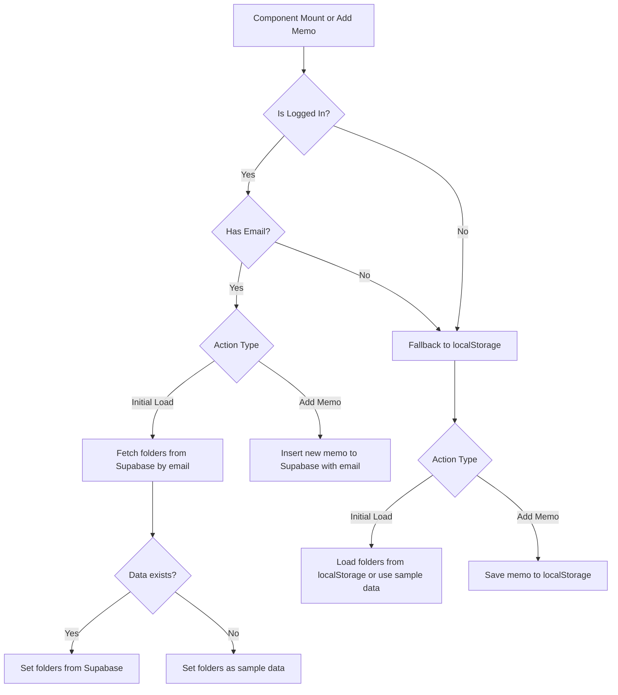

# 📎 웹 클립보드
> 메모를 쉽게 복사 및 저장 관리할 수 있는 웹 클립보드입니다.

홈화면 | 로그인 화면 | 메모 추가
--|--|--
 |  | 


<br>

## 🔗 Links

- [🌐 사이트 바로가기](https://tony96kimsh.github.io/WebClipboard/)  
- [📘 작업 로그 (Notion)](https://stump-smartphone-024.notion.site/React-Oauth-Cloud-DB-1e7f398452c380489bf0dbc33195c385?pvs=4)

---

## 📌 프로젝트 개요

### 제작 배경

QA 업무 중 이슈 보고서를 복사해 사용하는 일이 잦았고, 이를 위해 노션이나 메모앱을 활용하곤 했습니다. 하지만 다른 메모들과 섞여 있어 원하는 메모를 찾는 데 시간이 오래 걸렸고, 윈도우 클립보드 기능도 한계가 있었습니다.

그래서 복사와 메모를 효율적으로 분리하고 관리할 수 있는, **명확한 목적의 웹 클립보드** 앱을 제작하게 되었습니다.

### 기술 스택

- TypeScript
- React
- Google OAuth
- Supabase (Cloud DB, 개발 중)

---

## ✨ 주요 기능

1. 메모 클릭 시 자동 복사
2. 폴더로 메모 분류 가능
3. 로컬 스토리지 저장
4. Google OAuth 로그인
5. (진행 중) 로그인 시 Supabase와 동기화

---

## 🗂 프로젝트 구조

### 레이아웃 구성

- **헤더**: 앱 이름, 로그인/로그아웃
- **메인**:
  - 폴더 선택 메뉴
  - 메모 추가 입력란
  - 메모 리스트
- **풋터**: 깃허브, 이메일, 저작권 정보

---

### 📁 폴더 구조
```
/src
├── App.css                # 전체 앱 스타일 정의
├── App.tsx                # 앱의 루트 컴포넌트, 전반적인 상태 관리 및 렌더링 처리
├── assets
│   └── react.svg          # 리액트 로고 (기본 이미지, 사용 여부에 따라 달라짐)
├── components             # 주요 UI 컴포넌트 모음
│   ├── FolderMenu.css     # 폴더 선택 UI의 전용 스타일
│   ├── FolderMenu.tsx     # 폴더 리스트 및 선택 기능을 담당하는 컴포넌트
│   ├── InsertMemo.tsx     # 새로운 메모를 입력할 수 있는 입력창 컴포넌트
│   ├── MemoList.css       # 메모 리스트 UI의 전용 스타일
│   ├── MemoList.tsx       # 현재 선택된 폴더의 메모 리스트를 렌더링하는 컴포넌트
│   └── MemoModal.tsx      # 메모 수정 시 사용하는 모달 컴포넌트
├── data                   # 타입 정의 및 샘플 데이터
│   ├── Folder.ts          # 폴더 객체 타입 정의
│   ├── Memo.ts            # 메모 객체 타입 정의
│   └── Sample.ts          # 초기 렌더링을 위한 샘플 데이터들
```
### 🪜 코드 구조

#### 로그인 유무에 따른 데이터 읽기와 저장 동작

로그인 정보가 있으면 클라우드 DB에 저장하고 없을 경우 로컬 스토리지를 사용합니다.



#### 메모 CRUD 코드

``` tsx
// 메모 추가
const addMemo = (title: string, content: string) => {
  const newMemo: Memo = {
    id: crypto.randomUUID(),
    folderId: selectedFolderId,
    title,
    content,
    createdAt: new Date(),
    updatedAt: new Date(),
  };

  setMemos([newMemo, ...memos]);

  if (isLogin) {
    supabase.from("memos").insert([{ ...newMemo, email: userInfo?.email }]);
  } else {
    localStorage.setItem("memos", JSON.stringify([newMemo, ...memos]));
  }
};

// 메모 수정
const editMemo = (editedMemo: Memo) => {
  setMemos((prev) =>
    prev.map((memo) => (memo.id === editedMemo.id ? editedMemo : memo))
  );

  if (isLogin) {
    supabase
      .from("memos")
      .update({ ...editedMemo })
      .eq("id", editedMemo.id);
  } else {
    localStorage.setItem(
      "memos",
      JSON.stringify(
        memos.map((memo) => (memo.id === editedMemo.id ? editedMemo : memo))
      )
    );
  }
};

// 메모 삭제
const deleteMemo = (id: string) => {
  setMemos((prev) => prev.filter((memo) => memo.id !== id));

  if (isLogin) {
    supabase.from("memos").delete().eq("id", id);
  } else {
    localStorage.setItem(
      "memos",
      JSON.stringify(memos.filter((memo) => memo.id !== id))
    );
  }
};
```

#### 구글 Oauth 연결 코드

``` tsx
<GoogleLogin
  onSuccess={(credentialResponse) => {
    const token = credentialResponse.credential;
    const decoded: any = jwtDecode(token!);

    setUserInfo({
      email: decoded.email,
      name: decoded.name,
      picture: decoded.picture,
    });
    setIsLogin(true);
  }}
  onError={() => {
    setUserInfo(null);
    setIsLogin(false);
    alert("❌ 로그인 실패");
  }}
/>
```

### 🗄️ 데이터베이스 구조 (Supabase)

#### 📁 folders 테이블
| Column       | Type       | 설명                          |
|--------------|------------|------------------------------|
| `id`         | UUID (PK)  | 폴더의 고유 ID                  |
| `name`       | text       | 폴더 이름                      |
| `created_at` | timestampz | 폴더 생성 시각                  |
| `user_email` | text       | 사용자 이메일 (구분용)            |

#### 📝 memos 테이블
| Column        | Type       | 설명                           |
|---------------|------------|-------------------------------|
| `id`          | UUID (PK)  | 메모의 고유 ID                   |
| `folderId`    | UUID (FK)  | 연결된 폴더의 ID                 |
| `title`       | text       | 메모 제목                       |
| `content`     | text       | 메모 내용                       |
| `created_at`  | timestampz | 메모 생성 시각                   |
| `updated_at`  | timestampz | 메모 수정 시각                   |
| `user_email`  | text       | 사용자 이메일 (구분용)             |

#### 🔗 Table Relationship

```mermaid
erDiagram
  folders ||--o{ memos : contains
  folders {
    UUID id PK
    text name
    timestampz created_at
    text user_email
  }
  memos {
    UUID id PK
    UUID folderId FK
    text title
    text content
    timestampz created_at
    timestampz updated_at
    text user_email
  }
```

